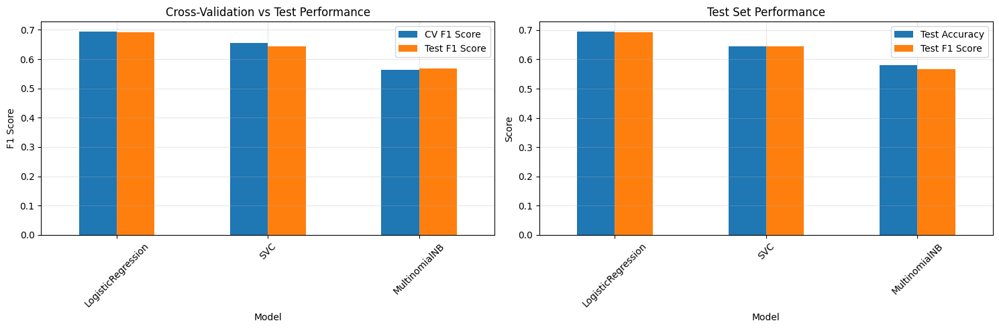
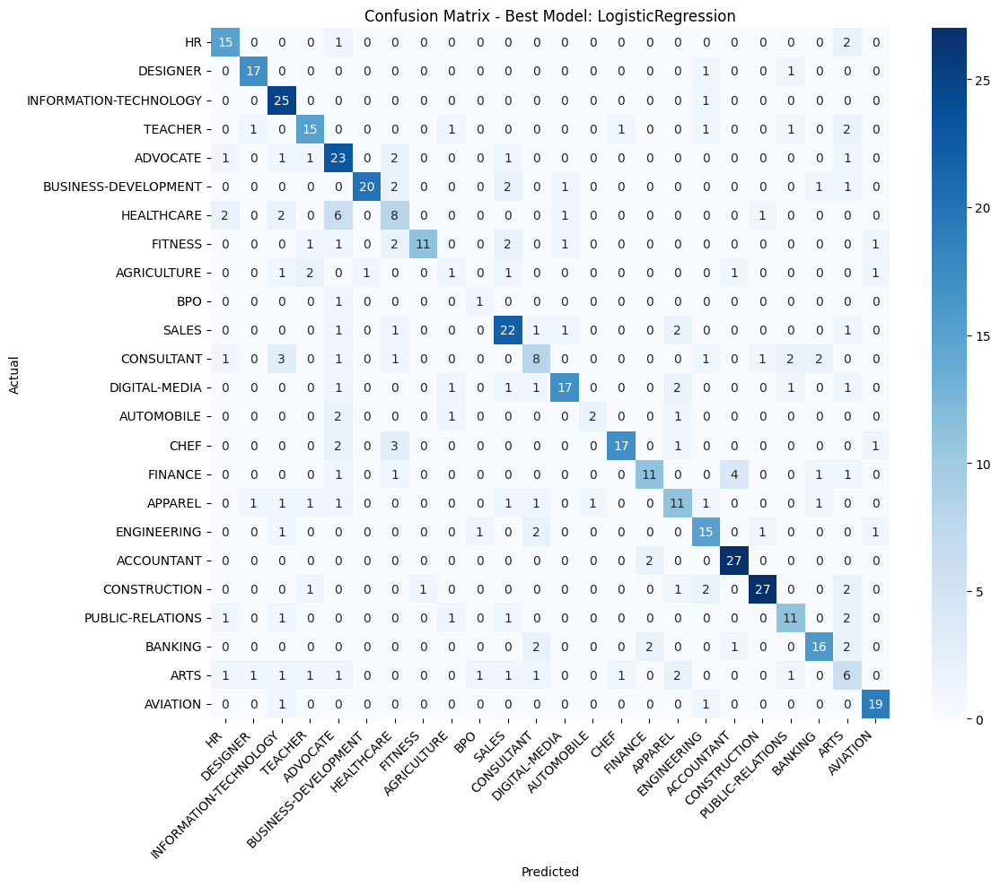

# Resume Classifier

A machine learning-powered web application that automatically classifies resumes into job categories.

## Live Demo

[Try the app here!](https://resume-classifier-zmu3wglfyzipbarixpd9oy.streamlit.app/)

## Features

- Paste resume text directly into the app
- ML-powered classification using TF-IDF and a Logistic Regression model
- Confidence scores for all job categories
- Supports 24 job categories:
  - Accountant, Advocate, Agriculture, Apparel, Arts
  - Automobile, Aviation, Banking, BPO, Business Development
  - Chef, Construction, Consultant, Designer, Digital Media
  - Engineering, Finance, Fitness, Healthcare, HR
  - Information Technology, Public Relations, Sales, Teacher

## How to Use

1. Copy resume text (plain text format works best)
2. Paste into the text area
3. Click "Classify Resume"
4. View the predicted job category and confidence scores

## Tech Stack

- **Frontend**: Streamlit
- **ML Model**: Scikit-learn (TF-IDF + Logistic Regression)
- **NLP**: NLTK for text preprocessing
- **Deployment**: Streamlit Community Cloud

## Local Development

```bash
# Install dependencies
pip install -r requirements.txt

# Run the app
streamlit run app.py
```

## Model Development Process

The complete model development and evaluation process is documented in [Resume_Classifier.ipynb](notebooks/Resume_Classifier.ipynb).

### Data Preprocessing

The preprocessing pipeline includes:

1. **Text Normalization**: Cleaning resume text by removing special characters and whitespace
2. **Tokenization**: Breaking down text into individual tokens using NLTK's WordPunctTokenizer
3. **Stop Word Removal**: Filtering out common English stop words using NLTK's stopwords corpus
4. **Corpus Creation**: Converting all 2,484 resumes into a normalized text corpus for model training

### Feature Extraction with TF-IDF

We used **TF-IDF (Term Frequency-Inverse Document Frequency)** vectorization to convert resume text into numerical features. TF-IDF helps identify important words in each resume by:

- **Term Frequency (TF)**: Measuring how often a word appears in a document
- **Inverse Document Frequency (IDF)**: Downweighting common words that appear across many documents
- This combination highlights domain-specific keywords that distinguish different job categories

### Hyperparameter Tuning

We evaluated three different classifiers using RandomizedSearchCV with 5-fold cross-validation:

#### Models Tested:
1. **Logistic Regression** - Linear model with L2 regularization
2. **Multinomial Naive Bayes** - Probabilistic classifier
3. **Support Vector Classifier (SVC)** - Linear kernel SVM

#### TF-IDF Hyperparameters Tuned:
- `ngram_range`: Tested unigrams (1,1), bigrams (1,2), and trigrams (1,3)
- `min_df`: Minimum document frequency (3, 5, 10)
- `max_df`: Maximum document frequency (0.7, 0.8, 0.9)
- `max_features`: Feature limit (None, 5000, 10000)

#### Model-Specific Hyperparameters:
- **Logistic Regression**: Regularization strength (C), penalty type, solver
- **Naive Bayes**: Alpha smoothing parameter, fit_prior flag
- **SVC**: Regularization (C), kernel type, gamma parameter

### Model Performance

**Final Results:**


*Cross-validation vs Test performance for all three models*

| Model | CV F1 Score | Test Accuracy | Test F1 Score |
|-------|-------------|---------------|---------------|
| Logistic Regression | 0.693 | 0.694 | 0.692 |
| SVC | 0.656 | 0.644 | 0.645 |
| Multinomial NB | 0.564 | 0.580 | 0.568 |

**Best Model: Logistic Regression**
- Test Accuracy: ~69%
- Test F1 Score: ~69%
- Trained on 2,484 resumes across 24 job categories

**Optimal TF-IDF Settings:**
- ngram_range: (1, 3) - captures unigrams, bigrams, and trigrams
- min_df: 5 - filters rare terms
- max_df: 0.9 - removes very common terms
- max_features: 10,000 - limits feature space

**Optimal Model Settings:**
- C: 100 - regularization strength
- penalty: L2 - ridge regularization
- solver: saga - handles large datasets efficiently

### Confusion Matrix


*Detailed classification performance across all 24 job categories*

The confusion matrix shows strong performance for categories like Accountant (93% recall), Aviation (90% recall), and Business Development (95% precision), while some categories like Agriculture and Arts prove more challenging due to limited training samples.

## Resume Dataset

The resume dataset was obtained from [Kaggle: Resume Dataset by Sneha Anbhawal](https://www.kaggle.com/datasets/snehaanbhawal/resume-dataset)

## Team

Team: Allen Snyder, Kevin Schroeder, Si Liang

Created: 10/30/2025
